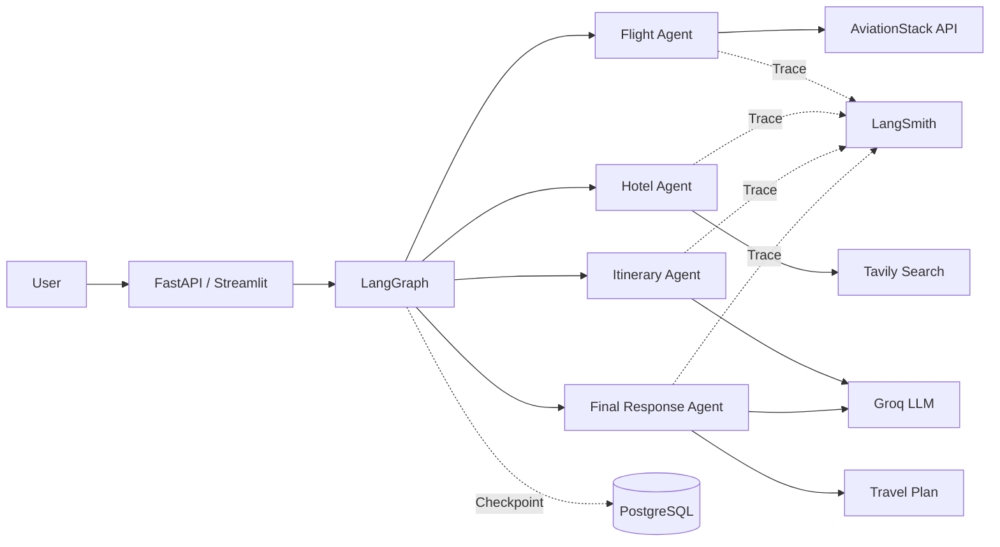
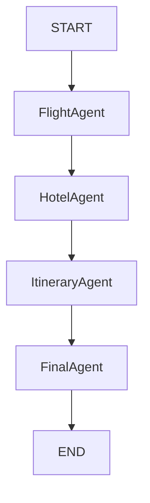
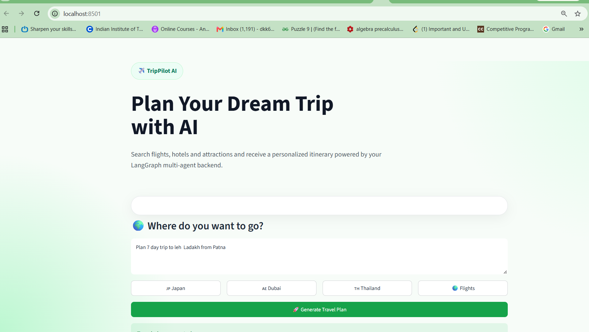
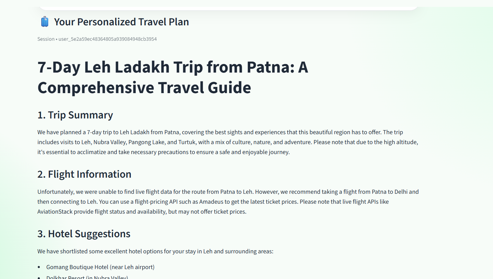
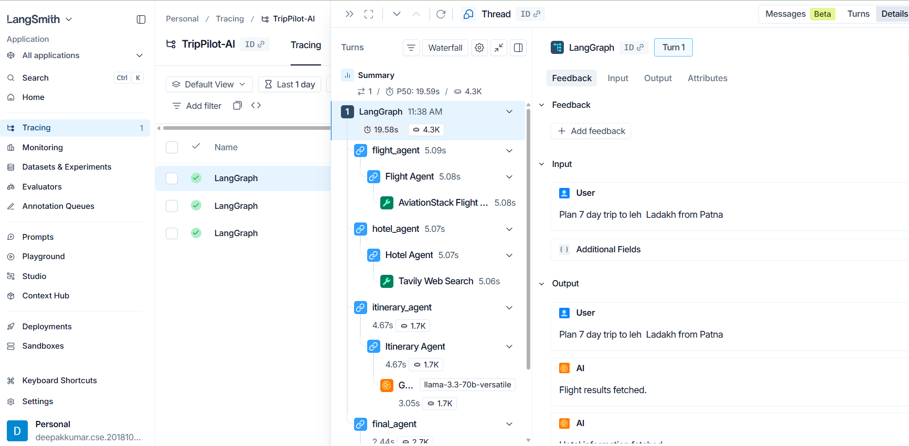

<!-- # TripPilot-AI

TripPilot-AI is a FastAPI and LangGraph multi-agent travel planner. It combines:

- Flight status lookup through AviationStack
- Hotel and web research through Tavily
- Itinerary and final response generation through Groq-hosted LLMs
- Optional LangGraph checkpoint persistence through PostgreSQL

## Setup

Create and activate a virtual environment, then install dependencies:

```powershell
python -m venv myenv
.\myenv\Scripts\Activate.ps1
pip install -r requirements.txt
```

Create your local `.env` from `.env.example` and fill in your keys:

```text
GROQ_API_KEY=your_groq_api_key
TAVILY_API_KEY=your_tavily_api_key
AVIATIONSTACK_API_KEY=your_aviationstack_api_key
DEFAULT_ORIGIN_IATA=DEL
```

`DATABASE_URL` is optional for local development. If it is missing, TripPilot uses in-memory LangGraph checkpoints. For production, configure PostgreSQL so conversations survive process restarts.

## Run

FastAPI UI:

```powershell
uvicorn app:app --host 127.0.0.1 --port 8000 --reload
```

Open:

```text
http://127.0.0.1:8000
```

Streamlit UI:

```powershell
streamlit run streamlit_app.py
```

Health check:

```text
GET /health
```

Travel planner API:

```text
POST /api/travel
```

Example body:

```json
{
  "message": "Plan a 5 day Japan trip from Delhi",
  "thread_id": "optional-user-thread-id"
}
``` -->

# ✈️ TripPilot AI

> **TripPilot AI** is a production-ready Multi-Agent AI Travel Planner
> built using **LangGraph**, **LangChain**, **Groq**, **FastAPI**,
> **Streamlit**, **PostgreSQL**, **LangSmith**, **Tavily**, and
> **AviationStack**.

It orchestrates multiple AI agents to search flights, discover hotels,
generate itineraries, and produce a complete travel plan.

------------------------------------------------------------------------

# 🚀 Features

-   🤖 Multi-Agent Architecture using LangGraph
-   ✈️ Live Flight Search (AviationStack)
-   🏨 Hotel Search (Tavily)
-   🗺️ AI Itinerary Generation
-   📝 Final Professional Travel Report
-   💾 PostgreSQL Checkpointing
-   📈 LangSmith Tracing
-   ⚡ FastAPI Backend
-   🎨 Streamlit UI
-   🔄 Thread-based Conversation Memory

------------------------------------------------------------------------

# 🛠️ Tech Stack

  Category        Technology
  --------------- ----------------------
  Language        Python
  Framework       LangGraph
  LLM             Groq (Llama 3.3 70B)
  Backend         FastAPI
  Frontend        Streamlit
  Database        PostgreSQL
  Search          Tavily
  Flight API      AviationStack
  Observability   LangSmith

------------------------------------------------------------------------

# 📂 Project Structure

``` text
TripPilot-AI/
├── agents/
│   ├── flight_agent.py
│   ├── hotel_agent.py
│   ├── itinerary_agent.py
│   ├── final_agent.py
│   └── state.py
├── tools/
│   ├── flight_tool.py
│   └── tavily_tool.py
├── static/
├── templates/
├── backend.py
├── config.py
├── app.py
├── streamlit_app_new.py
├── requirements.txt
└── README.md
```

------------------------------------------------------------------------

# 🏗️ Architecture



------------------------------------------------------------------------

# 🔄 Workflow



------------------------------------------------------------------------

# 🤖 Agents

## Flight Agent

-   Parses the travel request
-   Calls AviationStack
-   Returns live flight information

## Hotel Agent

-   Searches hotels using Tavily
-   Returns hotel recommendations

## Itinerary Agent

-   Uses Groq LLM
-   Generates a day-wise itinerary

## Final Agent

Combines: - Flight Results - Hotel Results - Itinerary

Produces: - Trip Summary - Flight Details - Hotel Suggestions -
Estimated Budget - Recommendations

------------------------------------------------------------------------

# 🧠 Shared State

``` python
TravelState

messages
user_query
flight_results
hotel_results
itinerary
llm_calls
```

------------------------------------------------------------------------

# 🔌 APIs

## POST /api/travel

### Request

``` json
{
  "message":"Plan a 7-day Japan trip from Delhi",
  "thread_id":"user123"
}
```

### Response

``` json
{
  "success": true,
  "thread_id": "user123",
  "answer": "...",
  "flight_results": "...",
  "hotel_results": "...",
  "itinerary": "...",
  "llm_calls": 2
}
```

------------------------------------------------------------------------

# ⚙️ Environment Variables

``` env
GROQ_API_KEY=

GROQ_MODEL=llama-3.3-70b-versatile

TAVILY_API_KEY=

AVIATIONSTACK_API_KEY=

DATABASE_URL=

DEFAULT_ORIGIN_IATA=DEL

APP_ENV=development
```

------------------------------------------------------------------------

# ▶️ Installation

``` bash
git clone https://github.com/yourusername/TripPilot-AI.git

cd TripPilot-AI

uv sync
```

or

``` bash
pip install -r requirements.txt
```

------------------------------------------------------------------------

# ▶️ Run FastAPI

``` bash
uvicorn app:app --reload
```

Visit:

    http://127.0.0.1:8000

------------------------------------------------------------------------

# ▶️ Run Streamlit

``` bash
streamlit run streamlit_app_new.py
```

------------------------------------------------------------------------

# 📈 LangSmith Observability

Every agent and tool is decorated using:

``` python
@traceable
```

This provides: - Prompt tracing - Tool tracing - Latency - Token usage -
Execution graph

------------------------------------------------------------------------

# 🌟 Future Roadmap

-   Flight pricing (Amadeus)
-   Booking.com Integration
-   Google Maps
-   Weather Agent
-   Visa Agent
-   Currency Agent
-   Restaurant Agent
-   Human Approval
-   Streaming Responses
-   LangSmith Evaluation
-   Guardrails
-   MCP Tool Support

------------------------------------------------------------------------

# 📸 Screenshots

<!-- # 📸 Screenshots -->

## 🏠 Home Page



---

## 🤖 Generated Travel Plan



---

## 📈 LangSmith Trace



------------------------------------------------------------------------

# 🤝 Contributing

1.  Fork the repository
2.  Create a feature branch
3.  Commit changes
4.  Push to GitHub
5.  Open a Pull Request

------------------------------------------------------------------------

# 📄 License

MIT License

------------------------------------------------------------------------

# 🙌 Acknowledgements

-   LangGraph
-   LangChain
-   Groq
-   FastAPI
-   Streamlit
-   LangSmith
-   Tavily
-   AviationStack

